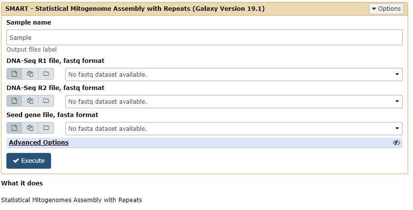
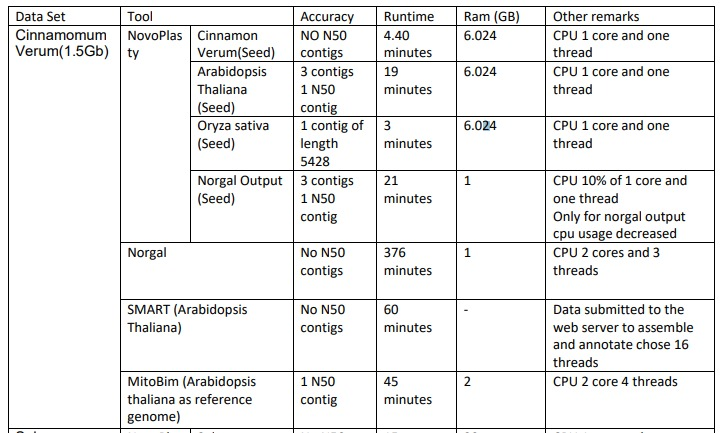
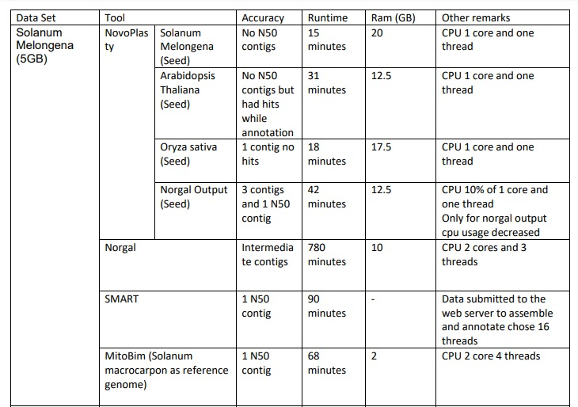
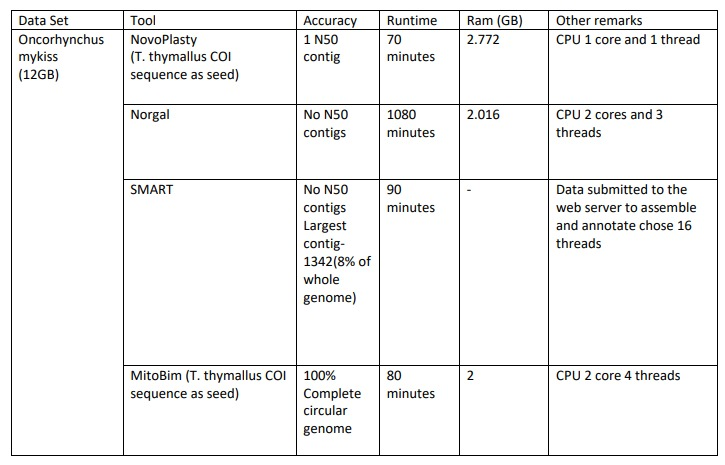
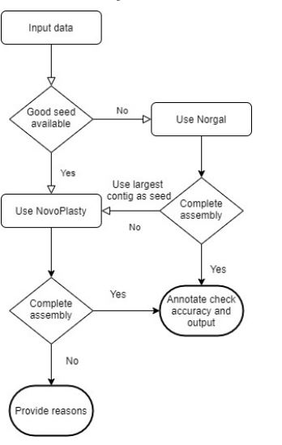

[comment]: # "This is the standard layout for the project, but you can clean this and use your own template"

# Project Title

#### Team

- E/15/330, K.Sathurshan, [email](mailto:name@email.com)
- E/15/366, S.Thinesh, [email](mailto:name@email.com)
- E/15/373, R.Vaheesan, [email](mailto:name@email.com)
#### Supervisors

- Dr. Asitha Bandaranayake, [email](mailto:asithab@eng.pdn.ac.lk)
- Prof. Pradeepa Bandaranayake, [email](mailto:pradeepag@agri.pdn.ac.lk)

#### Table of content

1. [Abstract](#abstract)
2. [Related works](#related-works)
3. [Methodology](#methodology)
4. [Experiment Setup and Implementation](#experiment-setup-and-implementation)
5. [Results and Analysis](#results-and-analysis)-
6. [Conclusion](#conclusion)
7. [Publications](#publications)
8. [Links](#links)

---

## Abstract
Genome sequencing and genome assembly are the computational process of converting the sequence composition of the gene within the cell of an organism in a human readable form. Mitochondria is an important genome in the cell and there is a need to study this genome for various reasons.
The process of determining the order of bases A,G,T,C in the genome is known as genome sequencing.While sequencing the genome the original genome is separated into huge number of small parts known as reads and the end results of sequencing is a huge pool of reads(strings of A,G,T,C).These reads must be assembled back in a computer so that a biologist can identify and annotate the functionality of it.
There are several techniques were developed to sequence the genome,
the modern approach is next generation sequencing.
Ilumina sequencing is one of the broadly used next generation sequencing method and this method produce large number of high precision sequencing  short reads whereas other older methods produce longer reads.So the computational complexity of assembling back this large amount of read is high but cost efficient.
Here we mainly discuss on low coverage sequencing data assembly.The sequencing data consist of multiple copies of same genome in low coverage data the number of copies are relatively lower than high coverage data.

In this project we examined the tools used for mitochondrial genome assembly by assembling differnt datasets and measured the parameters that make impact in the assembly process. From the results we obtained from the experiment we made decisions of doing mitochondrial genome assembly.

## Related works
There are several assembly pipelines suggested for assembling genome, below are the narrow downed pipelines/ tools used for mitochondrial genome assembly. There are two common approaches for assembly genome one is De novo assembly another one is Reference based alignment.Some tools use one of these approaches and some use hybrid approach consisting both.

Here let's discuss the tools that are used specifically for mitochondrial genome assembly

NovoPlasty

In NOVOPlasty there is a way to assemble genome from skim sequenced data, we can either assemble a whole organelle genome or isolate mitochondrial genome first and assemble it later. The best strategy for assembling depends on available data-set,computational power and reference genome availability. This tool uses a new algorithm to do the de novo assembly which is known as seed-extension, by this method NOVOPlasty claims that it assemble genome as accurate as other reference based assemblers such as MITObim,MIRA,ARC,SOAPdenova2.
NOVOPlasty decreases computational complexity by storing the reads in a hash table and seed-extend it. As this tool claims it took 11 minutes duration and 15 GB memory to assemble 99.98% of G.intermedia mitochondrion genome with 100 % accuracy where MITObim took 4777 minutes,63.4 GB memory to assemble 99.95% of genome with 99.93% accuracy and SOAPdenovo2 took  19 minutes,27 GB memory to assemble 99.98% of genome with 99.98% accuracy.

Norgal

Norgal is a tool used to extract mitochondria genome from WGS data and assemble it using de nova assembly. In previous methods like in MToolBox there is a need for reference mtDNA either from database or user input, but in Norgal it identifies the high frequency kmers (string fragmentations of genome) from WGS data to extract and assemble the mtDNA. Norgal is able to extract mtDNA by calculate the read depth of genome and assume the reads that have more read depth (frequency) than a specified threshold (nuclear read depth) are from mtDNA. Then it performs de nova assembly on those reads to assemble the genome.
The whole pipeline of Norgal is
Pre-processing reads -> Estimating nuclear read depth threshold -> Remove reads based on k-mer occurrences -> Assembly with high-frequency k-mers -> Annotation and validation
Norgal has more advantages than its earlier predecessors like MToolBox,MITOBim and NOVOPlasty. Still it has some flaws in its pipelines, like the high run time, Norgal is slower than above mention tools also it consume more memory (the peak usage was 38-48GB where MITOBim needs only 1-13 GB) and it cannot be applied to organisms that have low copy numbers of samples cause Norgal needs a high depth coverage of reads as the current project we are working mainly focus on extract and assemble genome with low coverage reads which will be an advancement to this tool. Overall as they claim Norgal is the current best when there are no reference genomes available.

SMART: Statistical Mitogenome Assembly with Repeats

Statistical Mitogenome Assembly with Repeats (SMART) is yet another proposed pipeline for automated assembly of complete circular mitochondrial genomes from WGS data. Reference based assembly tools are faster but they can't be used to assemble completely new mtDNA, Norgal can assemble the completely new genome by using de nova assembly but it requires high coverage reads and cause high runtime and memory. In Norgal and tools like it they attempt to remove reads from the nuclear genome by performing an assembly of the full set of reads and then using the read coverage of the longest contigs to estimate the coverage of the nuclear genome but in SMART it estimates the mean and standard deviation of mtDNA k-mers in WGS reads based on a seed sequence (This is not widely used approach of sequencing), then select the reads which has k-mer counts falling within three standard deviations of the estimated mean.
SMART claims that it provides better results than other tools like  Norgal, NOVOPlasty, PlasmidSPAdes and MToolBox but the run time and memory usage of this pipeline is not yet discussed.

## Methodology
Design Overview

This chapter covers how the work flow of the mitochondrial genome assembly optimization is planned. From the literature review we could find 
the tools that are dedicated for mitochondrial genome assembly. We then analyze the tools by reading and short listed some of them for experimental analysis.
Genome assembly remains a challenging computational problem, the next-generation sequencing technologies which generate a greater amount of data and 
make the assembly process more complex. There is a huge demand for a pipeline that will assemble a genome quickly and accurately. 
In this next-generation sequencing, the results are short reads, so we mainly focused on the tools that do short read assembly of mitochondria genome.

Conceptual Design

 

## Experiment Setup and Implementation

Prototype

We design an experimental setup to compare the tools that are specifically build to do mitochondrial assembly. In our experiment we first shortlist 4 tools for analysis they are: NovoPlasty: seed and extend algorithm & De novo assembly, Norgal : De novo assembly(No need for seeds),SMART : seed-and-extend algorithm & De novo assembly and Mitobim : Reference based assembly.

Data Collection

We choose the seed and reference genome of the datasets by analyzing their phylogeny. Available closest relatives of the species are used as seeds and reference genome. Here we used Cinnamomum Verum which is 1.5GB, Solanum Melongena which is 5GB, Homosapien Sapien which is 12MB and Oncorhynchus mykiss which is 12GB. Here we used Cinnamon Verum, Arabidopsis Thaliana, Oryza sativa, Solanum Melongena and output from Norgal assembly as seeds for NovoPlasty while assembling Cinnamomum Verum and Solanum Melongena. We used Arabidopsis Thaliana as a seed for SMART while assembling Cinnamomum Verum. We used Pan troglodytes seed for NovaPlasty while assembling Homosapien Sapien. For the NovaPlasty assembly of Oncorhynchus mykiss, we used T.thymallus COI sequence as seed. For mitobim we didn't use seeds but used references genome of close species so for Cinnamomum Verum only available closest species is Arabidopsis Thaliana mitochondrial genome, Solanum Melongena (egg plant) we used Solanum macrocarpon(African eggplant) mitochondrial genome, for Homosapien Sapien (human) we used Pan troglodytes(Chimpanzee) mitochondrial genome and for Oncorhynchus mykiss we used T.thymallus mitochondrial genome.

Tools

In our experiment we first shortlist 4 tools for analysis they are, NovoPlasty uses seed and extend algorithm where a seed input is given along the dataset so the assembly can begin with that seed. The de novo assembly starts from these seed contigs. Norgal uses De novo assembly so there are no need for seeds. SMART uses seed and extend algorithm and follows De novo assembly. Mitobim is a reference based assembly tool. These 4 tools have their own uniqueness in assembling mitochondrial genome.

Server Details

University of Peradeniya, Aiken Server(RAM - 252GB Number of CPU cores - 32 cores) and AgBC Server (RAM - 262GB Number of CPU cores - 48 cores)

Configure MitoBim Tool

We used docker image for MitoBim tool. MITObim image contains a stripped down version of Ubuntu 16.04 and all necessary executables and dependencies to run the latest version of MITObim. Here we show how to recover the complete mitochondrial genome of Thymallus thymallus using the mitochondrial genome of Salvelinus alpinus as a starting reference. We used AgBc server for run mitobim assembly.

Step 1 - specified a working directory on the machine that will be synced with the /home/data directory in the image and enter the self contained shell environment to run MITObim

    WORKING_DIR=/your/desired/working/dir
    sudo docker run -i -t -v $WORKING_DIR/:/home/data
        chrishah/mitobim /bin/bash

Step 2 - Test the wrapper script by doing

    ~/PATH/TO/MITObim.pl

Step 3 - Do the mapping assembly with MIRA 4. MIRA is a Sequence assembler and sequence mapping for whole genome shotgun and EST / RNASeq sequencing data. 

    ln -s /PATH/TO/testdata1/Tthymallus-150bp-300sd50-interleaved.fastq 
        reads.fastq
    ln -s /PATH/TO/testdata1/Salpinus-mt-genome-NC_000861.fasta reference.fa

Step 4 - Create the manifest file and specifying the parameters for the MIRA assembly

    echo -e "\n#manifest file for basic mapping assembly with 
        illumina data using  MIRA 4\n\nproject =  initial-mapping
        -testpool-to-Salpinus-mt\n\njob=genome,mapping,accurate\n\
        nparameters = -NW:mrnl=0 -AS:nop=1 SOLEXA_SETTINGS -CO:
        msr=no\n\nreadgroup\nis_reference\ndata = reference.fa\nstrain =
        Salpinus-mt-genome\n\nreadgroup = reads\ndata = reads.fastq\
        ntechnology = solexa\nstrain = testpool\n" > manifest.conf

 Step 5 - run MIRA 4

    mira manifest.conf

Step 6 - Baiting and iterative mapping using the MITObim.pl script

    /PATH/TO/MITObim.pl -start 1 -end 10 -sample testpool -ref
        Salpinus_mt_genome -readpool reads.fastq -maf
        initial-mapping-testpool-to-Salpinus-mt_assembly
        /initial-mapping-testpool-to-Salpinus-mt_d_results
        /initial-mapping-testpool-to-Salpinus-mt_out.maf &> log

Step 7 - After the process has finished looking into the log file

    tail log
    
    
Configure Norgal Tool

Norgal uses kmer frequencies to try to assemble the mitochondrial genome from NGS sequencing reads (currently only Illumina paired end reads are supported). It requires Python2.7+ or Python3, Java and matplotlib. The size of our input data determines how much memory we'll use. Norgal has been tested on computers with 16GB, 32GB, and 64GB of RAM. In other words, if our reads are just a few GB each, it should work; but, if our reads are 12 GB each, and our machine only has 12 GB of RAM, it will almost certainly not work, and we'll have to run it on a node or anything similar. But in our case, we used Aiken and Agbc server both are 256GB RAM. So we did not address any issue during the assembly.

Step 1 - Download the program

    git clone https://github.com/kosaidtu/norgal.git

Step 2 - Execute the norgal.py script

    python norgal/norgal.py -h

Step 3 - Run the paired end data(f.fq and r.fq) 

    python norgal.py -i f.fq r.fq -o norgal_output --blast

Configure NOVOPlasty Tool

NOVOPlasty is a de novo assembler and heteroplasmy/variance caller for short circular genomes. First, we have to find a suitable seed and the seed file should be formatted in the same way as a regular fasta file. We need to concern the seed sequences that are identical in mitochondrial and chloroplast genomes should be avoided. After that we have to create a configuration file, here we have to specify the path of the dataset, k-mer number, Reference sequence path and Seed inout path. Then finally we have to run the NOVOPlasty with configuration file.

    perl NOVOPlasty4.3.pl -c config.txt

Configure SMART Web Interface

The Figure below shows the SMART Web Interface here we have to input the paired end read data and seed file then it will output the assembly and annotation details.

## Results and Analysis

Assembly Results

As first part of the experiment a comparative analysis is done using NovoPlasty,NORGAL, MitoBim and SMART.

Assembly Results of Cinnamomum Verum

For the Cinnamomum Verum dataset we used 4 different seeds for assembling in NovaPlasty tool. When we used Cinnamon Verum(A small part of the dataset to be assembled) as the seed there were no N50 contigs present in the output file and it took less than 5 minutes run time. This assembly used 6.02 4GB ram and only one CPU core and one thread ran by the tool. When we used Arabidopsis Thaliana as the seed there were 3 contigs and 1 N5O contig present in the output file. The assembling process took 19 minutes to finish. This process used 6.024 GB ram and only one CPU core and one thread ran by the tool.When we used Oryza sativa as the seed there were 1 contig of length 5428 is present in the output file. The assembling process took 3 minutes to finish. This process used 6.024 GB ram and only one CPU core and one thread ran by the tool.When we used the norgal output as the seed there were 3 contigs and 1 N5O contig present in the output file. The assembling process took 21 minutes to finish. This process used 1 GB ram and only one CPU core and one thread ran by the tool.

When we assembled Cinnamomum Verum using Norgal tool, there were no N50 contig present on the output file. It tooks 376 minutes to finish and it used 1GB ram. It took 2CPU cores and ran 3 threads.

When we assembled Cinnamomum Verum using SMART, we used Arabidopsis Thaliana as the seed and no N50 contigs present in the output file. It approximately took 60 minutes to finish. After we submitted the data to the web server to assemble and annotate it choose 16 threads to run.

When we asembled Cinnamomum Verum using MitoBim tool, there was only one N50 contig present in the output. It took approximately 45 minutes and used 2GB of RAM. It took 2CPU core and used 4 threads.

Assembly Results of Solanum Melongena

For the Solanum Melongena dataset we used 4 different seeds for assembling in NovaPlasty tool. When we used Solanum Melongena (A small part of the dataset to be assembled) as the seed there were no N50 contigs present in the output file and it took 15 minutes run time. This assembly used 20 4GB ram and only one CPU core and one thread ran by the tool. When we used Arabidopsis Thaliana as the seed there were no contigs in the output but it had hits while the annotation process. The assembling process took 31 minutes to finish. This process used 12 GB ram and only one CPU core and one thread ran by the tool.When we used Oryza sativa as the seed there were 1 contig with no hits present in the output file. The assembling process took 18 minutes to finish. This process used 17.5 GB ram and only one CPU core and one thread ran by the tool. When we used the norgal output as the seed there were 3 contigs and 1 N5O contig present in the output file. The assembling process took 42 minutes to finish. This process used 12.5 GB ram and only one CPU core and on thread ran by the tool.

When we assembled Solanum Melongena using Norgal tool, there were intermediate contigs present on the output file. It tooks 780 minutes to finish and it used 10GB ram. It took 2CPU cores and ran 3 threads.

When we assembled Solanum Melongena using SMART, one N50 contig present in the output file. It approximately took 90 minutes to finish. After we submitted the data to the web server to assemble and annotate it choose 16 threads to run.

When we asembled Solanum Melongena using MitoBim tool, there was only one N50 contig present in the output. It took approximately 68 minutes and used 2GB of RAM. It took 2CPU core and used 4 threads.

Assembly Results of Homosapien Sapien

For the Homosapien Sapien dataset we used Pan troglodytes seed for assembling in NovaPlasty tool. We got Complete Circular genome in the output and it took 6 minutes to finish. It used 2GB ram and 1 core CPU and ran 1 thread.

When we assembled Homosapien Sapien using Norgal tool, we got Complete Circular genome in the output and it took 50 minutes to finish. It used 1GB ram and 2 core CPUs and ran 3 threads.

When we assembled Homosapien Sapien using SMART, we got Complete Circular genome in the output and it took 30 minutes to finish. After we submitted the data to the web server to assemble and annotate it choose 16 threads to run.

When we asembled Homosapien Sapien using MitoBim tool, we got Complete Circular genome in the output and it took 8 minutes to finish. It used 2GB ram and 2 core CPUs and ran 4 threads.

Assembly Results of Oncorhynchus mykiss

For the Oncorhynchus mykiss dataset we used T.thymallus COI sequence as seed for assembling in NovaPlasty tool. We got 1N50 contig in the output and it took 70 minutes to finish. It used 2.772GB ram and 1 core CPU and ran 1 thread.

When we assembled Oncorhynchus mykiss using Norgal tool, there were no N50 contigs in the output and it took 1080 minutes to finish. It used 2.016GB ram and 2 core CPUs and ran 3 threads.

When we assembled Oncorhynchus mykiss using SMART, there were no N50 contigs in the output and it took 90 minutes to finish. After we submitted the data to the web server to assemble and annotate it choose 16 threads to run.

When we asembled Oncorhynchus mykiss using MitoBim tool, we got Complete Circular genome in the output and it took 80 minutes to finish. It used 2GB ram and 2 core CPUs and ran 4 threads.

## Conclusion

Assembling a mitochondrial genome very accurately and efficiently for all kind of datasets is what everyone involved with genomics are looking forwards and this study also going in that way. We have assembled 4 type of dataset with four tools and analyzed it's performance and accuracy, from the results we obtained we can come to some conclusions on assembling mitochondrial genome. The conclusions we derived from the results can be divided into 3 scenarios which are Dataset based, Runtime based and Resource Requirement. From the 1st scenario we can conclude that all a good assembly needed is a good dataset, in the sense of dataset it means the seeds,reference genome and the size of the dataset. If the size is small the accuracy is much better.If the seeds are good enough we can get good acccurate and efficient assembly from NovoPlasty and SMART tools.But finding such seeds is a crucial task. The second scenario is the run time of the assembly , if there are neither reference genome nor seeds we can still assemble the dataset using Norgal but it consumes more time. As from these two scenarios a pipeline can be developed as shown in the below figure that in case if there are no good seeds we can use the Norgal assembly output of the same species as seed and it will give better assembly.

## Publications
1. [Semester 7 report](./)
2. [Semester 7 slides](./)
3. [Semester 8 report](./)
4. [Semester 8 slides](./)
5. Author 1, Author 2 and Author 3 "Research paper title" (2021). [PDF](./).

## Links

[//]: # ( NOTE: EDIT THIS LINKS WITH YOUR REPO DETAILS )

- [Project Repository](https://github.com/cepdnaclk/repository-name)
- [Project Page](https://cepdnaclk.github.io/repository-name)
- [Department of Computer Engineering](http://www.ce.pdn.ac.lk/)
- [University of Peradeniya](https://eng.pdn.ac.lk/)

[//]: # "Please refer this to learn more about Markdown syntax"
[//]: # "https://github.com/adam-p/markdown-here/wiki/Markdown-Cheatsheet"
